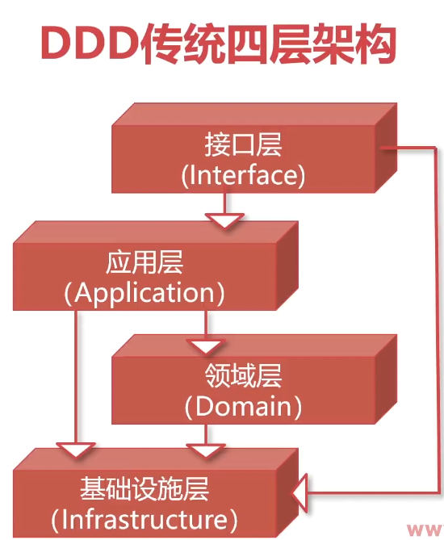
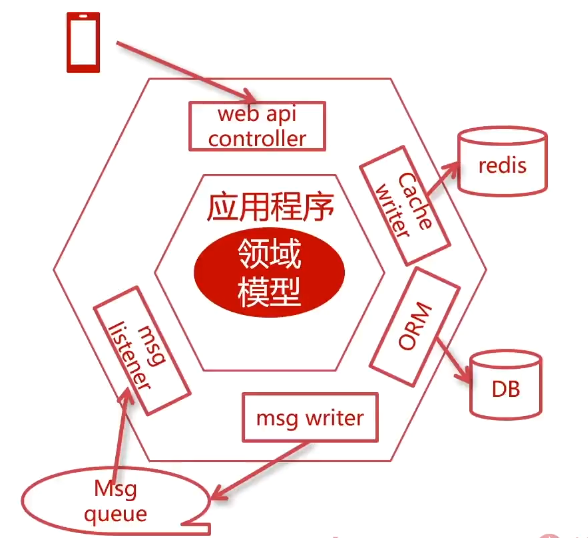

<!--
 * @Author: ChenRun
 * @Date: 2022-02-24 22:29:39
 * @Description: 
-->
# 用分层架构隔离领域模型

## 为什么要隔离领域模型

- 严格按照领域模型来编写代码
- 建模和实现中都有破坏该原则的因素
- 架构分层能够避免模型在实现过程中被省略或污染

### 传统方式的问题

- 领域模型容易被省略，变成贫血模型
- 容易演变成基于数据的设计，一切从表结构开始
- 领域模型与技术实现混杂，易被技术实现绑架

## DDD传统四层架构和洋葱架构

### DDD传统四层架构

### 洋葱架构

## 如何建立分层架构
