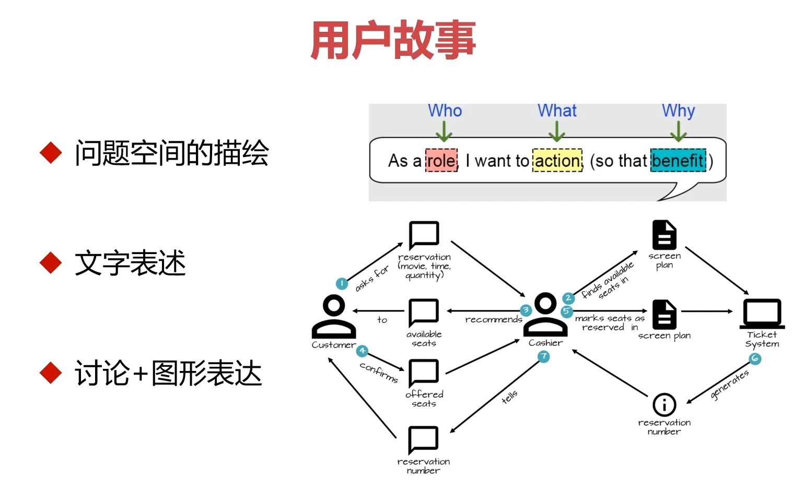
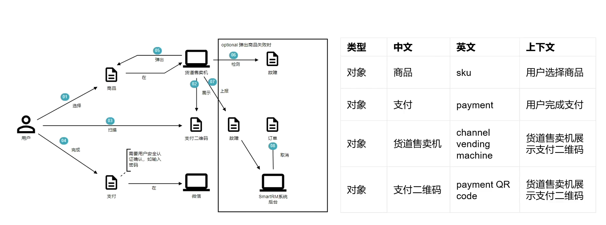
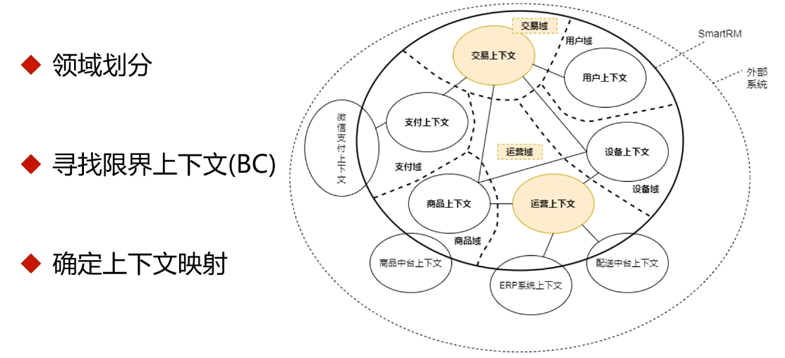
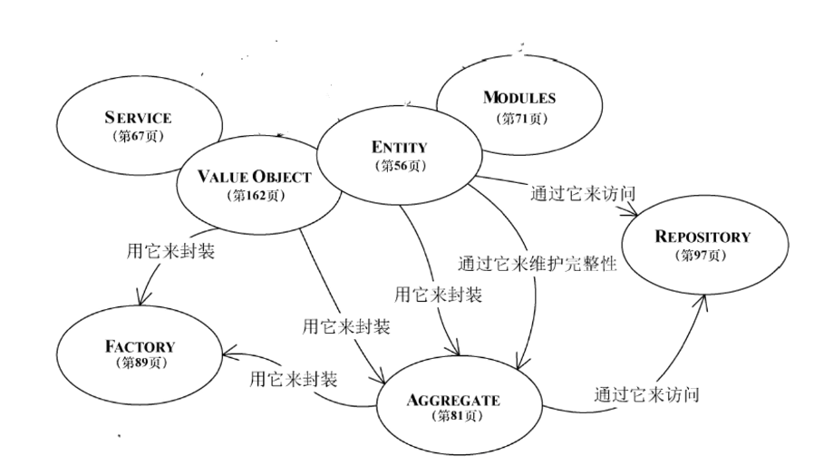
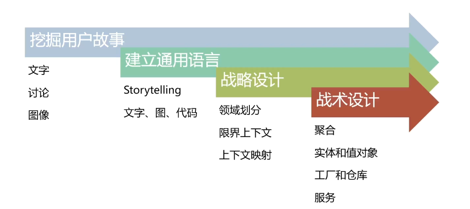

<!--
 * @Author: ChenRun
 * @Date: 2022-02-24 20:17:05
 * @Description: 
-->
# 建模和设计的整体流程

## 用户故事

## 通用语言

- 在讨论模型和定义模型时，团队使用同一种语言
- 领域知识需要在团队内部高效流转，模型需要描述
- 通用语言药体现在代码里

## 战略设计

- DDD中对问题空间和解决方案空间进行分解的过程
- 目的是分解模型以控制复杂性
- 是DDD与传统建模和设计方法的核心区别之一

## 战术设计

- 对各个BC的细节设计过程
- BC内部的模型结构与完整技术方案

## 常用建模方法

- Domain Storytelling (领域故事陈述法)
- Event Storming (事件风暴法)
- 4C (四色建模法)

## 总结

